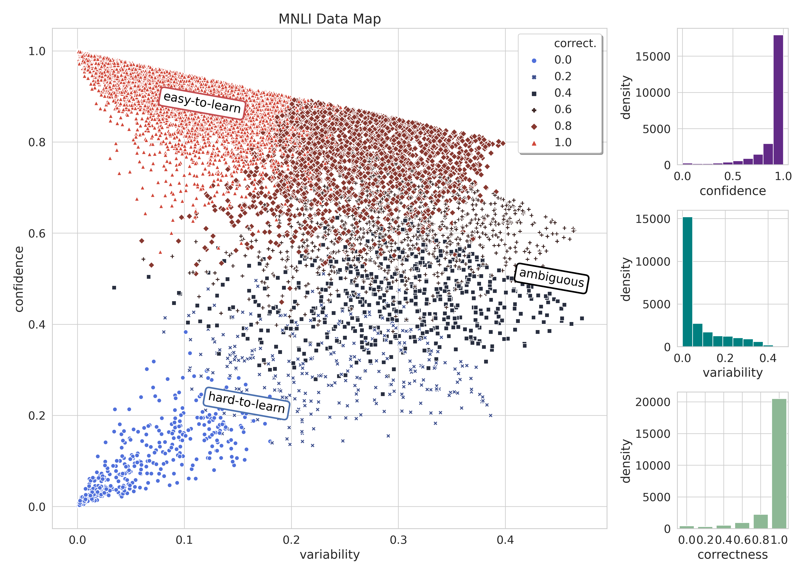
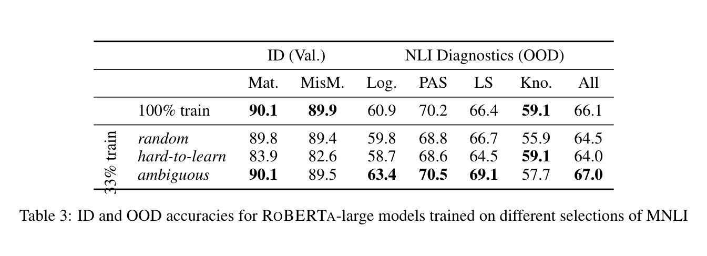

# Reproducing Dataset Cartography


### Training RoBERTa on MNLI
The first step to reproducing the paper is to finetune RoBERTa-large on the full MNLI dataset and obtain the corresponding data map.

```
MODEL_OUTPUT_DIR=output/mnli

python -m cartography.classification.run_glue \
    -c configs/mnli.jsonnet \
    --do_train \
    --do_test \
    --train train.tsv \
    -o $MODEL_OUTPUT_DIR
```

Then we plot the data map!
```
python -m cartography.selection.train_dy_filtering \
    --plot \
    --task_name MNLI \
    --model_dir $MODEL_OUTPUT_DIR \
    --plot_title "MNLI Data Map"
```




### Result 1: Ambiguous examples improve out-of-domain generalization
We compare the result of training on the full data with training on a random 33%, the most hard-to-learn 33%, and the most ambiguous 33% of training data. First, we select each subset of training data by running the following code with `METRIC` set to each of `random`, `confidence`, and `variability`.

```
TASK=MNLI
MODEL_OUTPUT_DIR=output/mnli/
DATA_DIR=data/glue/MNLI/
DATA_OUTPUT_DIR=data/glue/MNLI/filtered/$METRIC/

python -m cartography.selection.train_dy_filtering \
    --filter \
    --task_name $TASK \
    --model_dir $MODEL_OUTPUT_DIR \
    --metric $METRIC \
    --output_dir $DATA_OUTPUT_DIR \
    --data_dir $DATA_DIR
```

Then we train a new model on each of these subsets.

```
FRACTION=0.33
MODEL_OUTPUT_DIR=output/mnli_ambiguous/ambiguous_$FRACTION

python -m cartography.classification.run_glue \
    -c configs/mnli.jsonnet \
    --do_train \
    --do_test \
    --train filtered/ambiguous/cartography_variability_$FRACTION/train.tsv \
    -o $MODEL_OUTPUT_DIR
```




### Result 2: Mixing in easy-to-learn examples

We investigate how performance is affected as we vary the size of ambiguous and random subsets. To do this, we run the same scripts as in the previous section but with different values of `FRACTION` in `0.01`, `0.05`, `0.1`, `0.17`, `0.25`, `0.33`, `0.5`, and `0.75`.

Then, we select the mixed data.

```
TASK=MNLI
MODEL_OUTPUT_DIR=output/mnli/
DATA_DIR=data/glue/MNLI/
DATA_OUTPUT_DIR=data/glue/MNLI/filtered/mixed/
METRIC=mixed

python -m cartography.selection.train_dy_filtering \
    --filter \
    --task_name $TASK \
    --model_dir $MODEL_OUTPUT_DIR \
    --metric $METRIC \
    --output_dir $DATA_OUTPUT_DIR \
    --data_dir $DATA_DIR
```

And train models on the different ratios of mixed data in the same way as before.

### Additional experiment: active learning

First, we initialize our training set `train.tsv` to randomly selected 10% of the full MNLI training data. Then we train a model on the training set while calculating training dynamics on `unlabeled.tsv`.

```
MODEL_OUTPUT_DIR=output/mnli_al_0.1/0/

python -m cartography.classification.run_glue \
    -c configs/mnli.jsonnet \
    --do_train \
    --train al_0.1/train.tsv \
    --dev al_0.1/unlabeled.tsv \
    -o $MODEL_OUTPUT_DIR
```

We consider setting `METRIC` to `mean_variance`, `final_confidence`, and `random`, which defines our selection strategy for choosing examples from `unlabeled.tsv`. Then, for each iteration, we run the following commands:

1. Select the data according to the selection strategy. Since we set n to be 5% of the full MNLI training data, this is equivalent to `n=19635`.
```
TASK=MNLI
MODEL_OUTPUT_DIR=output/mnli_al_0.1/$METRIC/$(($ITERATION-1))/
DATA_DIR=data/glue/MNLI/al_0.1/
DATA_OUTPUT_DIR=data/glue/MNLI/al_0.1/$METRIC/$ITERATION/

python -m cartography.selection.train_dy_filtering \
    --filter \
    --n 19635 \
    --task_name $TASK \
    --model_dir $MODEL_OUTPUT_DIR \
    --metric $METRIC \
    --output_dir $DATA_OUTPUT_DIR \
    --data_dir $DATA_DIR \
    --data_file unlabeled.tsv \
    --split 'dev'
```

2. Concatenate the selected data with the training data from the previous iteration.
```
python -m cartography.selection.append_selected \
    --metric $METRIC \
    --it $ITERATION
```

3. Retrain a model on the augmented training data.
```
MODEL_OUTPUT_DIR=output/mnli_al_0.1/$METRIC/$ITERATION/

python -m cartography.classification.run_glue \
    -c configs/mnli.jsonnet \
    --do_train \
    --train al_0.1/$METRIC/$ITERATION/cartography_${METRIC}_19635/train.tsv \
    --dev al_0.1/unlabeled.tsv \
    -o $MODEL_OUTPUT_DIR
```

These commands can be chained together with a job scheduler like the slurm workload manager on `hyak`. You can run the entire experiment at once with

```
id=$(sbatch --parsable scripts/train.sh)

for metric in random mean_variability final_confidence
do
    for iteration in 1 2 3 4
    do 
        id=$(sbatch --parsable --dependency=afterany:$id --export=METRIC=$metric,ITERATION=$iteration scripts/select_unlabeled_data.sh)
        id=$(sbatch --parsable --dependency=afterany:$id --export=METRIC=$metric,ITERATION=$iteration scripts/combine_train_selected.sh)
        id=$(sbatch --parsable --dependency=afterany:$id --export=METRIC=$metric,ITERATION=$iteration scripts/train_al.sh)
    done
done
```

where `scripts/select_unlabeled_data.sh`, `scripts/combine_train_selected.sh` and `scripts/train_al.sh` each contain the commands described above.
